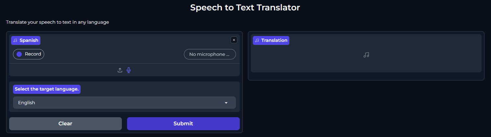
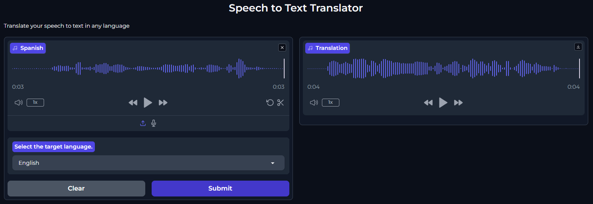

# Simple Speech to Text Translator

This project is a speech-to-text translation application that uses Gradio for the user interface, Whisper for speech-to-text transcription, Translator for text translation, and gTTS for text-to-speech conversion.

## Requirements

- Python 3.7 or higher
- The following Python libraries:
  - gradio
  - whisper
  - translate
  - gtts





## Installation

1. Clone this repository:

    ```sh
    git clone https://github.com/dominguesleo/Simple-Speech-to-Text-Translator.git
    cd Simple-Speech-to-Text-Translator
    ```

2. Create a virtual environment and activate it:

    ```sh
    python -m venv venv
    venv\Scripts\activate  # On Windows
    # source venv/bin/activate  # On macOS/Linux
    ```

3. Install the dependencies:

    ```sh
    pip install -r requirements.txt
    ```

## Usage

1. Run the main script:

    ```sh
    python main.py
    ```

2. Open your web browser and go to the address shown in the terminal (default is `http://127.0.0.1:7860`).

3. Upload an audio file or record your voice using the microphone.

4. Select the target language for translation.

5. The application will transcribe the audio, translate the text, and generate an audio file with the translation.

## Cleanup Function
The application is configured to delete the generated `.mp3` file upon closing the execution. This is done for testing purposes to ensure that temporary files do not accumulate.